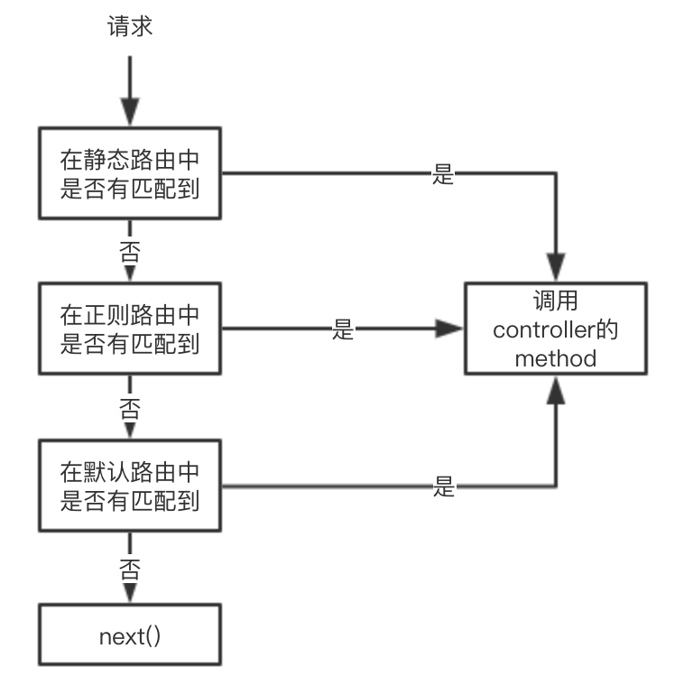

# 路由（Router）

路由主要用于确认如何响应客户端的请求，当用户访问一个地址时，需要找到指定的 controller 的指定方法对用户请求进行处理。确认一个请求主要对请求的两部分：路径和特定 HTTP 请求方法，进行判断。

## 使用

为了方便用户对路由的选择，Router 被作为参数的方式传入到 Uma 中。

```javascript
import { Router } from '@umajs/router'

const uma = Uma.instance({
  Router,
  ROOT: __dirname,
})

uma.start(8058)
```

## @Path 修饰器

如果你不想通过默认路由的方式访问时，`Uma`提供了`@Path修饰器`来指定 controller 方法被访问的 URI 格式。

> 可以装饰 class，作为跟路由，只装饰 class 不生效，必须和 method 装饰配合使用。装饰 class 只有能有一个 string 参数
> 可以装饰 method，没有根路由的时候直接作为路由使用，有根路由的时候和根路由组合使用
>
> export declare function Path(...args: [...string[]] | [TPathObjArgs]): Function;
>
> args 路由参数 eg:
>
> Path() // 仅在 class 有路由装饰时 装饰 method 使用
>
> Path('/p1')
>
> Path('/p1', 'p2')
>
> Path({ value: '/p1' })
>
> Path({ value: '/p1', method: RequestMethod.GET })
>
> Path({ value: ['/p1', '/p2'], method: RequestMethod.GET })
>
> Path({ value: ['/p1', '/p2'], method: [RequestMethod.GET, RequestMethod.POST] })

### 修饰 class

@Path 修饰器除了能修饰方法外，还可以修饰 controller 的 class，被修饰后的 class，如果内层的方法同时也添加了 @Path 修饰器，那么该方法的访问路径将和 class 上的 @Path 指定路径合并使用。

例如我们对上面创建的 test.controller.ts 文件做以下修改：

```javascript
import { BaseController, Path } from '@umajs/core'

@Path('/page') // 根路由
export default class Test extends BaseController {
  @Path() // 路由： /page
  @Path('/home') // 路由： /page/home
  index() {
    return this.send('this is page/index router')
  }
  test() {
    return this.send('this is test/index router')
  }
}
```

在浏览器地址栏通过访问`127.0.0.1:端口号/page/home` 或 `127.0.0.1:端口号/page/`就可以看到页面显示出`this is page/index router`。

> 注意：v2.0 版本之后，框架取消了文件默认路由，即我们不能通过`127.0.0.1:端口号/page/test`访问到目标函数，接口将会返回 Not Found。请确保所有路由都被`@Path`装饰。
>
> 同时，访问`127.0.0.1:端口号/page`也可以看到页面显示出`this is test/index router`

### 修饰方法

例如我们对上面创建的 test.controller.ts 文件做以下修改：

```javascript
export default class Test extends BaseController {
  @Path('/home')
  index() {
    return this.send('this is test/index router')
  }
}
```

在浏览器地址栏通过访问`127.0.0.1:端口号/home`就可以看到页面显示出`this is test/index router`。

> 注意：此时，在浏览器地址栏访问`127.0.0.1:端口号/test/index`就不能访问到 index 方法了，因为在`Uma`中，被@Path 修饰器修饰过的方法，不能再通过默认路由的方式访问。

### MethodType

在很多访问中，我们需要加入 MethodType 的限制，示例如下：

```javascript
import { BaseController, Path, RequestMethod } from '@umajs/core'

export default class Test extends BaseController {
  @Path({ value: '/home', method: RequestMethod.POST })
  index() {
    return this.send('this is test/index router')
  }
}
```

在浏览器地址栏通过访问`127.0.0.1:端口号/home`会展示 NOT FOUND，这是因为限制了只能采用 POST 访问。

> 注意：框架内置了 POST 请求处理 `koa-body`，如果需要开启，实例化 `Uma` 时需要传入 `bodyParse` 参数，并且安装 `koa-body` 依赖

### 指定多个路径

同一个方法上允许设置多个 Path 路径。

例如我们对上面创建的 test.controller.ts 文件做以下修改：

```javascript
import { BaseController, Path } from '@umajs/core'

@Path('/page')
export default class Test extends BaseController {
  @Path('/home', '/abc')
  index() {
    return this.send('this is test/index router')
  }
}
```

在浏览器地址栏通过访问`127.0.0.1:端口号/page/home`或者`127.0.0.1:端口号/page/abc`都可以看到页面显示出`this is test/index router`。

也可以通过多个@Path 修饰器修饰的方式指定多个路径。

例如我们对上面创建的 test.controller.ts 文件做以下修改：

```javascript
import { BaseController, Path } from '@umajs/core'

@Path('/page')
export default class Test extends BaseController {
  @Path('/home', '/abc')
  @Path('/test')
  index() {
    return this.send('this is test/index router')
  }
}
```

在浏览器地址栏通过访问`127.0.0.1:端口号/page/home`或者`127.0.0.1:端口号/page/abc`或者`127.0.0.1:端口号/page/test`都可以看到页面显示出`this is test/index router`。

和方法不同，一个 class 只允许使用一个@Path 修饰器，同时一个@Path 修饰器只接收一个参数。

例如我们对上面创建的 test.controller.ts 文件做以下修改：

```javascript
import { BaseController, Path } from '@umajs/core'

@Path('/page')
@Path('/tpl')
export default class Test extends BaseController {
  @Path('/home', '/abc')
  @Path('/test')
  index() {
    return this.send('this is test/index router')
  }
}
```

此时，只有最上面的`@Path('/page')`生效了，因为修饰器会先执行最接近自己的，@Path('/tpl')先被作用，但是@Path('/page')又将它覆盖了。

同样，如果你在 class 上设置`@Path('/page', '/tpl')`这种传入多个参数的格式，程序会报错，因为修饰 class 时，@Path 只接收一个参数。

### 正则匹配

我们对上面这种直接使用具体字符串形式设置的路由称为`静态路由`，路径除了使用`/home`这种字符串的格式外，还支持使用正则形式，我们称之为`正则路由`。

例如我们对上面创建的 test.controller.ts 文件做以下修改：

```javascript
import { BaseController, Path } from '@umajs/core'

@Path('/page')
export default class Test extends BaseController {
  @Path('/:name')
  index() {
    return this.send('this is test/index router')
  }
}
```

在浏览器地址栏通过访问`127.0.0.1:端口号/page/任意字符`都可以看到页面显示出`this is test/index router`。同时，我们可以通过`@Param修饰器`或者`ctx.params`的方式获取到当前`name`的值，@Param 修饰器会在后面介绍。

正则路由通过[path-to-regexp](https://github.com/pillarjs/path-to-regexp)库进行匹配，具体格式格式参考 path-to-regexp 库。

### 匹配顺序

`Uma`会按照的指定顺序去匹配路由，当命中某一规则时，即进入该 controller 的方法中，了解匹配的顺序当我们设置了重复的路由时很有帮助。

`Uma`匹配路由的顺序如下：



请求进来时，会先从静态路由中查找是否有匹配到的，没有的话会从正则路由中匹配是否有满足的，还未找到的话会按照静态路由的格式查找是否有匹配的，当这几种情况都不满足时，返回 Not Found。

### Path 扩展

框架在 `@Path` 装饰器的基础上还提供了一些其它快捷的路由装饰器 [@umajs/path](../other/path.md)

## 路由参数处理

在上面的正则路由中我们提到过@Param 修饰器，`UMajs`中默认只提供了两种修饰器@Param 和@Query 来方便的获取请求中的参数。对于更丰富的参数处理场景，框架提供了一个专门处理参数的装饰器工具包，[@umajs/arg-decorator](../other/ArgDecorator.md);方便开发者对参数进行接收，校验判断和类型转换。

### @Param，@Query 参数处理

例如我们对上面创建的 test.controller.ts 文件做以下修改：

```javascript
import { BaseController, Path } from '@umajs/core'
import { Param, Query } from '@umajs/arg-decorator'
@Path('/page')
export default class Test extends BaseController {
  @Path('/:name')
  index(@Param('name') name: string, @Query('name') title: string) {
    console.log(`name: ${name}`)
    console.log(`title: ${title}`)
    return this.send('this is test/index router')
  }
}
```

在浏览器中访问`127.0.0.1:端口号/page/test?name=uma`，我们可以看到控制台打印出：

```shell
name: test
title: uma
```

@Param 和@Query 修饰器可以快捷的获取到请求中的 param 和 query 参数，@Param 传入的名称要和@Path 中设置的名称一致，@Query 传入的名称要和请求的 query 参数名称一致，才能正确获取到。

同时，使用@Param 和@Query 修饰器不区分参数顺序

```javascript
- index(@Param('name') name: string, @Query('name') title: string)
// 参数顺序变化也可以正确获取
+ index(@Query('name') title: string, @Param('name') name: string)
```

当然，除了通过@Param 和@Query 修饰器的方式获取参数外，`Uma`还保留了 koa 的参数获取方式，可以从上下文中获取：

```javascript
import { BaseController, Path } from '@umajs/core'
import { Param, Query } from '@umajs/arg-decorator'

@Path('/page')
export default class Test extends BaseController {
  @Path('/:name')
  index(@Param('name') name: string, @Query('name') title: string) {
    // ====> 从ctx中获取参数
    console.log(this.ctx.param.name)
    console.log(this.ctx.query.title)
    return this.send('this is test/index router')
  }
}
```

**对于POST类型路由请求，参数获取和处理请查看[@Body](../other/ArgDecorator.md#示例)**