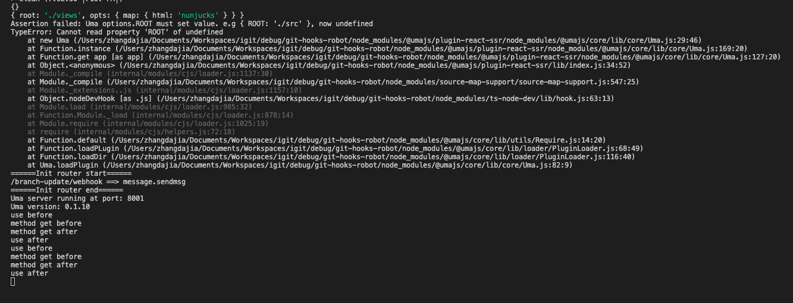

# umajs-react-ssr

> `Umajs-react-ssr`是由[@umajs/plugin-react-ssr](https://github.com/Umajs/plugin-react-ssr) 搭配[Srejs](https://github.com/dazjean/Srejs)构建的轻量级，使用简单，灵活的`React`服务端渲染解决方案;可以在`controller`和`middleware`中灵活使用,通过模板引擎式的语法对`react`页面组件进行服务端渲染。

## 1、插件介绍

`plugin-react-ssr`插件扩展了`Umajs`中提供的统一返回处理`Result`对象，新增了`reactView`页面组件渲染方法，可在`controller`自由调用,使用类似传统模板引擎；也同时将方法挂载到了 koa 中间件中的`ctx`对象上；当一些公关的页面组件，比如 404、异常提示页面、登录或者需要在中间件中拦截跳转时可以在`middleware`中调用。

## 2、特性

- 不默认路由，不需区分前端路由和后端路由概念，且支持页面级组件 AB 测；`灵活`
- 页面组件中没有`__isBrowser__`之类变量对`ssr`和`csr`模式进行特殊区分处理;`统一`。
- 自定义`HTML`采用`htmlWebpackPlugin`,没有`runtime`，页面响应速度更高;`高性能`。
- 支持`html`中使用`nunjucks`类模板引擎语法实现`SEO`；`易上手`。
- 页面开发不依赖框架包装的任何模块，保持原生的`React`开发体验;`友好,易升级`。
- 数据获取由服务端统一处理加工，页面视图开发和数据加工分开处理；`逻辑更清晰`。
- 支持`SSR`和`CSR`动态调整，支持`SSR`缓存,降级。`高可用`。
- 支持其他`koa`开发框架使用。`可扩展`。
- 支持 MPA,各页面组件可单独构建，`可页面级更新`。

## 3、插件安装

```shell
yarn add @umajs/plugin-react-ssr --save
```

## 4、插件配置

```ts
// plugin.config.ts
export default <{ [key: string]: TPluginConfig }>{
  'react-ssr': {
    enable: true,
    options: {
      rootDir: 'web', // 客户端页面组件根文件夹
      rootNode: 'app', // 客户端页面挂载根元素ID
      ssr: true, // 全局开启服务端渲染
      cache: false, // 全局使用服务端渲染缓存 开发环境设置true无效
      prefixCDN: '/', // 客户端代码部署CDN前缀
    },
  },
}
```

## 5、web 目录结构

```js
   - web # rootDir配置可修改
        - pages # 固定目录
            - home #页面名称
                - index.tsx
                - index.scss
```

## 6、创建 react 页面组件

> 页面组件开发模式支持 js ,tsx。

```tsx
import './home.scss'
import React from 'react'
type typeProps = {
  say: string
}
export default function (props: typeProps) {
  const { say } = props
  return <div className="ts-demo">{say}</div>
}
```

## 7、脚手架初始化模板工程【推荐】

> 在 cli 中支持快速创建`umajs-react-ssr`模板工程。

```shell
npm i @umajs/cli -g  // 安装cli工具
uma project umajs-react-demo  //通过uma初始化工程，选择react模板工程
```


```
cd umajs-react-demo
yarn install
yarn start

```

## 8、API

> 插件扩展了`Umajs`中提供的统一返回处理`Result`方法，新增了`reactView`页面组件可在`controller`自由调用,方式类似传统模板引擎使用方法；也同时将方法挂载到了 koa 中间件中的`ctx`对象上；当一些公关的页面组件，比如 404、异常提示页面、登录或者需要在中间件中拦截跳转时可以在`middleware`中调用。

```ts
interface TviewOptions{
    ssr?: boolean, // 全局开启服务端渲染
    cache?: boolean, // 全局使用服务端渲染缓存
    useEngine?:boolean // 渲染自定义html的页面组件时，选择性开启使用模板引擎
}
Result.reactView(viewName:string,initProps?:object,options?:TviewOptions);
ctx.reactView(viewName:string,initProps?:object,options?:TviewOptions);
```

_如果 options 参数传递为空 则默认会使用全局配置属性，全局配置采用插件集成时传递的 options 参数_

**注意** `cache`只在`生产环境`开启有效。

## 9、**controller**中使用

```ts
import { BaseController, Path } from '@umajs/core'
import { Result } from '@umajs/plugin-react-ssr'

export default class Index extends BaseController {
  @Path('/')
  index() {
    return Result.reactView(
      'home',
      { say: 'hi,I am a ReactView' },
      { cache: true }
    )
  }
}
```

## 10、**middleware**中使用

> 对于中间件的使用，引入顺序需要在插件之后。

```js
;async (ctx, next) => {
  try {
    await next()
  } catch (e) {
    return ctx.reactView('error', { msg: e.stack }, { cache: false })
  }
}
```

## 11、**browserRouter**使用

> 在页面组件中使用 react-router 时，只能在 controller 中使用，切需要服务端对路由做支持。框架默认集成了 BrowserRouter，无需开发者在页面组件中引入

```js
// 页面组件 web/browserRouter/index.js
export default class APP extends Component {
    render() {
        return (
            <Switch>
                <Route exact path="/" component={Home} />
                <Route exact path="/about" component={About} />
                <Route exact path="/about/:msg" component={About} />
                <Route component={Home} />
            </Switch>
        );
    }
}

// 服务端路由 前后端路由规则必须保持一致
@Path("/browserRouter","/browserRouter/:path")
browserRouter() {
    return Result.reactView('browserRouter',{say:"hi,I am a ReactView"},{cache:true});
}
```

## 12、**SEO 和自定义 HTML**

> 在 SEO 场景时，需要动态修改页面的标题和关键字等信息时，我们可以在自定义 html 中使用模板引擎语法，使用模板引擎时需要先开启使用`@umajs/plugin-views`插件并设置`useEngine:true`;建议和`nunjucks`搭配使用。[参考 demo](https://github.com/Umajs/umajs-react-ssr/tree/master/web/pages/template)。

- 插件配置

```js
// plugin.config.ts
views: {
        enable: true,
        name: 'views',
        options: {
            root: `${process.cwd()}/views`,
            autoRender:true,
            opts: {
                map: { html: 'nunjucks' },
            },
        },
    },
```

- 设置 useEngine

```ts
// src/index.controller
//调用时开启使用模板引擎标识，为提高性能，对未动态修改模板数据的页面组件不要设置此属性
Result.reactView(
  'index',
  { msg: 'This is the template text！', title: 'hi,umajs-react-ssr' },
  { cache: false, useEngine: true }
)
```

- 模板

> 框架内置 HTMLWebpackPlugin 插件，开发者在页面组件同级目录下可以覆盖默认 html 模板自定义引入第三方资源和脚本。 更多规则使用请看[自定义 HTML](https://github.com/dazjean/Srejs/blob/mian/doc/htmlTemplate.md)

```html
<!-- web/pages/index/index.html -->
<!DOCTYPE html>
<html>
  <head>
    <meta http-equiv="Content-Type" content="text/html; charset=UTF-8" />
    <meta charset="utf-8" />
    <meta
      name="viewport"
      content="initial-scale=1.0,maximum-scale=1.0,minimum-scale=1.0,user-scalable=0,width=device-width"
    />
    <meta name="format-detection" content="telephone=no" />
    <meta name="format-detection" content="email=no" />
    <meta name="format-detection" content="address=no;" />
    <meta name="apple-mobile-web-app-capable" content="yes" />
    <meta name="apple-mobile-web-app-status-bar-style" content="default" />
    <meta name="keywords" content="{{msg}}" />
    <title>{{title}}</title>
    <!-- 引入第三方组件库样式 -->
  </head>
  <body>
    <div id="app"></div>
    <!-- 引入第三方sdk脚本 -->
  </body>
</html>
```

## 13、生产部署

> 在部署生产环境之前，客户端代码需要提前编译。否则线上首次访问时会耗时比较长，影响用户体验。编译脚本命令为`npx srejs build`

```js
"scripts": {
    "dev": "ts-node-dev --respawn src/app.ts",
    "build": "tsc && npx srejs build",
    "prepublish": "npm run build",
    "prod": "node app/app.js --production"
  },

```

**源码请查看[`@umajs/plugin-react-ssr`](https://github.com/Umajs/plugin-react-ssr) 和 [`Srejs`](https://github.com/dazjean/Srejs) 欢迎 Star 和提供使用反馈。**

## 14、案例

- [uma-css-module](https://github.com/dazjean/Srejs/tree/mian/example/uma-css-module)
- [uma-react-redux](https://github.com/dazjean/Srejs/tree/mian/example/uma-react-redux)
- [uma-useContext-useReducer](https://github.com/dazjean/Srejs/tree/mian/example/uma-useContext-useReducer)

## 15、FAQ

- 引入插件后启动项目报错`TypeError:Cannot read property 'ROOT' of undefined`
  

> 此问题为项目`@umajs/core`版本冲突导致，解决方案为升级项目所依赖的包版本号，确保项目依赖的包版本号**大于或者等于**`@umajs/plugin-react-ssr`所依赖的`@umajs/core`版本号
